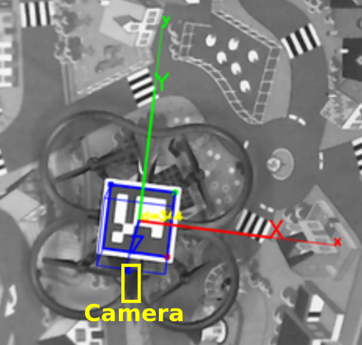

# Velocity Controller - TU Darmstadt Parrot Ar.Drone 2.0 Quadcopter

## Introduction
This package is designed to control the translational velocities of the Parrot Ar.Drone 2.0.
The main tasks of the package are the following:
- synchronize the data from the different measurements
- ensure a contineously state estimate 
- compensate the inherrent time delays of the closed loop

The whole system receives two packages and publishes two packages.  
**Input**   

- /ardrone/odometry
- /cmd_vel_ref

**Output**  

- /odometry/prediction
- /PID/cmd_vel  
The package needs the reference velocity and the measurements from the quadcopter to compute a future state vector and the actuating variable of the quadcopter.
The wifi communication delay is contineously measusred.

## Running Nodes
- /ekf_localization
- /run_control
- /ping_node

## Installation
Open a terminal and go to your catkin workspace for example catkin_ws or you can create a new workspace. 
Then clone the repository in your /src folder of your workspace and build it using catkin_make command.   
For example: 

**Terminal:**
```
cd ~/catkin_ws/src
git clone https://tobias_t_@bitbucket.org/tobias_t_/ardrone_velocity.git
cd ..
rosdep install --from-paths src -i
catkin_make 
```
## Usage:

**Terminal:**
```
cd /yourPath/ardrone_velocity
roslaunch launch/ardrone_velocity.launch
```

This command will start all nodes together. 


## Detailed Information 

**Package: robot_localization**  
- robot_localization -> ekf_localization  
- robot_localizazion -> ping_node

For this purpose the EKF implementation is used and adopted to fit needs of this project. The core modifications are:  

1. Usage of the dynamical model of the parrot ardrone instead the default use of a 3 dimensional omnidirectional ground robot which is based on a linear identification of the ardrone.
2. Added the ability to use control inputs of the ardrone for the kalman filter prediction state.
3. Added the ability to deal with delayed measurements without running the kalman filter in a delayed state.
4. Usage of two kalman filter states. The first one is used a the prediction and correction state when all measurements are available. 
   The second state is used for long term ahead prediction.
5. Implementation of a h-step ahead predictor based on a kalman filter and the identificated linear model of the ardrone. 
6. Use of the TcpNoDelay feature of ros to reduce the latency if TCP is used.
7. Dynamical measurement of the actual time delay based on a ping measurement. 

The orignal package can be found here: https://github.com/cra-ros-pkg/robot_localization

**Package: velocity controller PID**   
- velocity_control -> run_control

This package is using a modified PID control algorithm to control the velocity of the parrot ardrone and is using the predicted state of the robot_localizazion package.
The parameters of the controller can be changed dynamically. These means a change of parameters during the flight is possible. 
The main modifications are:  

1. Using of saturation to limit the output
2. Anti-windup to limit the value of the integral part of the pid controller. 
3. Smith filter for the derivative part. 
4. The derivative part can be based on the error or the velocity. In this use case the error based derivative term delivered better results. 
5. Set point weighting is used to reduce the overshoot.
6. A open loop feedforward controller can be additionally used to accelerate the set point reaching based on calculated tilt angle. 


**Package: velocity controller PID**   
- coordinate_transformation -> run_transform

This node provides a nonlinear coordinate transformation from the camera frame to the quadcopter frame.
The transformation has two steps. Firstly, the transformation from the camera to the marker frame is performed. Secondly, a transformation from the marker frame to the quadcopter frame is performed. 
To do this, the marker has to be aligned in a predefined configuration. Here, the markers y-direction points in the minus x-direction of the quadcopter (oppsite direction of the quadcopter front camera). 




